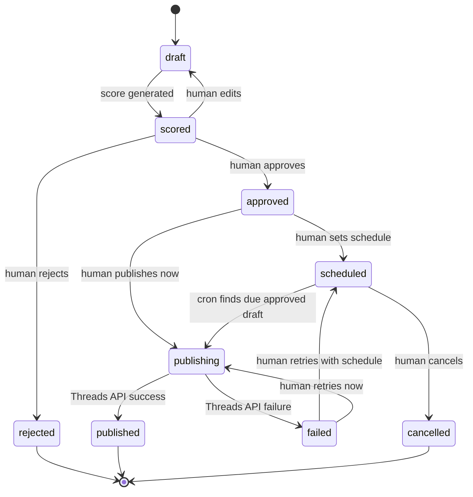
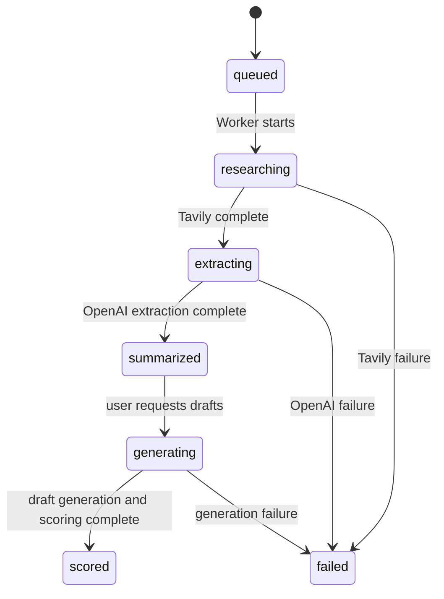
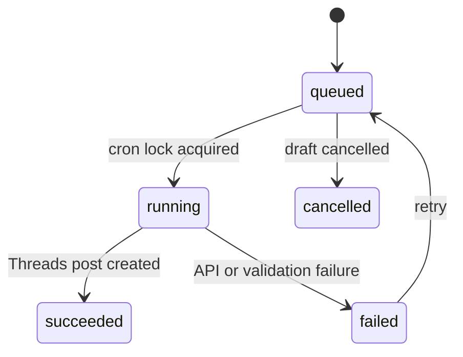

# Viral OS MVP State Machine

## Draft State Machine

## Guard Conditions
- `approved -> publishing` requires `approved_by` and `approved_at`.
- `scheduled -> publishing` requires `status = scheduled` and `scheduled_at <= now()`.
- `publishing -> published` requires Threads API success.
- `publishing -> failed` stores error details.
- No automated path may skip `approved`.

## Research State Machine

## Publish Job State Machine

